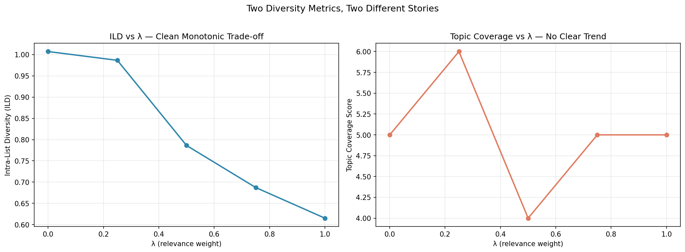

# Diversity-Aware Recommendation System

Mitigating echo chambers in online video platforms using content-based filtering and Maximal Marginal Relevance (MMR) re-ranking.

## Overview

Mainstream recommendation systems are optimized almost exclusively for engagement :  watch time, click-through rate, retention. This creates a well-documented side effect: the **echo chamber**, where users are served an increasingly narrow slice of content that reinforces their existing preferences.

This project treats diversity not as a constraint on relevance, but as a **co-equal optimization objective**. It combines content-based filtering with an MMR-based re-ranking layer, producing recommendations that are simultaneously relevant and topically diverse.

**What this project proves:** diversity can be traded against relevance in a controllable, measurable way (via λ), and the trade-off itself has been rigorously characterized using two independent metrics.
**What this project does not prove:** that the resulting diverse recommendations are preferred by real users — that would require user interaction data this project does not have. See [Limitations](#limitations.md) for the precise reasoning.

## Key Results



Running MMR across the full λ spectrum on real seed videos produced two consistent findings, plus a follow-up experiment that resolved an open question between them:

| λ | Intra-List Diversity (ILD) | Topic Coverage (of 10) |
|---|---|---|
| 0.0 | 1.007 | 5 |
| 0.25 | 0.986 | 6 |
| 0.5 | 0.786 | 4 |
| 0.75 | 0.687 | 5 |
| 1.0 | 0.615 | 5 |

- **ILD decreases monotonically as λ increases** — exactly as theory predicts. Pure similarity ranking (λ=1) produces the least diverse list; pure diversity ranking (λ=0) produces the most.
- **Topic Coverage Score does *not* follow the same clean trend**, even when list size is doubled (top_n=20). MMR's greedy, pairwise selection process optimizes for *raw dissimilarity* at each step, which doesn't guarantee the final list spreads across many topic clusters.
- **Follow-up experiment : does forcing cluster spread close the gap? Yes.** A cluster-aware variant (select the single best-matching candidate from each of 20 topic clusters, falling back to MMR for any remaining slots) was implemented and tested against pure MMR on the same seed video:

  | Method | ILD | Topic Coverage (of 10) |
  |---|---|---|
  | Pure MMR (λ=0.5) | 0.786 | 4 |
  | Cluster-aware | 0.723 | **10** |

  Cluster-aware selection more than doubled topic coverage (4 → 10), confirming that MMR's greedy selection was indeed leaving coverage on the table. It came at a small cost to ILD (0.786 → 0.723), since picking the single best item per cluster doesn't optimize pairwise dissimilarity the way MMR does. Neither method strictly dominates, they optimize for different notions of diversity. Full writeup: `results_cluster_aware.md`.
- At λ=1.0, the recommender for an exam-prep seed video returned near-identical daily uploads from a single channel : a clear, concrete demonstration of the exact echo-chamber problem this project addresses. At λ=0.5, the same seed surfaced genuinely varied content while retaining several on-topic results.

Full result tables and seed-by-seed breakdowns: `results_lambda_sweep.md`, `results_lambda_sweep_seed2.md`, `results_ild_vs_lambda.md`, `results_topic_coverage.md`, `results_cluster_aware.md`. Evaluation scope decisions: `limitations.md`.

## Dataset

[YouTube Trending Video Dataset](https://www.kaggle.com/datasets/datasnaek/youtube-new) (Kaggle) — combined US and India regions, ~22,400 unique videos after deduplication.

Due to file size constraints, raw and processed datasets are not included in this repo. Download from the link above and place CSVs in a `data/` folder to reproduce.

## Methodology

### 1. Data Preparation
Combined US + IN trending data, handled missing descriptions, removed duplicate video entries (videos trend across multiple days), and merged title/tags/description into a unified content field.

### 2. Feature Engineering
Three representations were built and compared:

- **TF-IDF** — lightweight, keyword-level similarity
- **Sentence embeddings** (`all-MiniLM-L6-v2`) — semantic, meaning-level similarity
- **Title-weighted embeddings** (final representation used) — titles weighted 3x over tags/description, since titles carry more reliable topic signal (with the caveat that titles can also be clickbait)

A real debugging finding from this stage: early TF-IDF similarity scores were dominated by **channel boilerplate** (sign-off text, affiliate links) rather than actual topical content — e.g., two completely unrelated videos from the same creator scored 95%+ similarity purely due to shared gear-list text in descriptions. This was diagnosed by inspecting raw text overlap, addressed through text cleaning, and further improved by title-weighting once it became clear that even cleaned embeddings still carried some channel-style bias.

### 3. Candidate Generation
Given a seed video, candidates are retrieved via cosine similarity over the title-weighted embeddings, prioritizing recall before downstream re-ranking.

### 4. Diversity-Aware Re-ranking (Core Contribution)
Candidates are re-ranked using Maximal Marginal Relevance, implemented from scratch and wrapped in a reusable `RecommendationEngine` class (`src/recommender.py`):

```
Score(i) = λ · Relevance(i, query) − (1−λ) · max Similarity(i, already_selected)
```

At λ=1, the system reduces to pure similarity ranking (baseline). At λ=0, it maximizes diversity regardless of relevance. The system was evaluated across the full λ spectrum on multiple seed videos to characterize this trade-off — see Key Results above.

A cluster-aware alternative was also implemented and benchmarked against MMR (see Key Results), directly testing whether explicit topic-cluster spread closes the gap between two diversity metrics that disagreed under pure MMR.

### 5. Baseline Comparison
A naive similarity-only recommender (λ=1) serves as the baseline. All diversity improvements are measured against it using two metrics: Intra-List Diversity and Topic Coverage Score.

## What Differentiates This Project

- **Algorithmic depth** — diversity is a first-class objective, with MMR implemented from scratch and debugged, not just referenced
- **Rigorous evaluation** — two independent diversity metrics, tested across multiple seeds and list sizes, with disagreements between them explained and then directly tested via a follow-up experiment
- **Documented debugging** — real issues (boilerplate-driven similarity inflation, channel-style bias, a stale-state loop bug in the MMR implementation) were found, diagnosed, and fixed, with before/after evidence kept in the notebooks
- **Intellectual honesty** — this system achieves topic-level diversity, not true viewpoint diversity, and explicitly scopes out metrics (Precision@K, Recall@K, Novelty Score) that would require data this project doesn't have, rather than faking them

## Scope and Limitations

- **Diversity was measured; perceived recommendation quality was not.** This project proves that diversity increases as λ decreases (via ILD and Topic Coverage). It does not prove that the resulting recommendations are perceived as good by real users — increasing diversity by construction guarantees items are measurably different, not that they are welcome or relevant. Validating that would require real user judgments (ratings, clicks, or a preference study comparing λ=1 vs. λ=0.5 lists), which this dataset does not provide. The honest claim this project supports is narrower than "this is a better recommender" — it is "this is a working, controllable mechanism for trading relevance against diversity, with the trade-off itself rigorously measured." See `limitations.md` for the full reasoning.
- Diversity is approximated at the topic level via content similarity — individual stance/viewpoint is not detected
- No real user interaction data is available, so relevance-side metrics (Precision@K, Recall@K, Novelty Score) are not computed — see `limitations.md`
- Non-English content has reduced TF-IDF signal due to English-only stopword/token handling; embeddings partially mitigate this
- Creator/channel writing style can influence similarity scores independently of topic, a structural limitation of text-only signals
- MMR's greedy selection optimizes pairwise dissimilarity, not topic-cluster coverage directly — confirmed and partially resolved by the cluster-aware experiment above, which trades a small amount of ILD for substantially better coverage

## Future Work

- A small user preference study: show paired λ=1 vs. λ=0.5 recommendation lists for the same seed and ask which users would actually choose to watch next — the most direct way to close the user-evaluation gap above
- A hybrid re-ranker: cluster-aware selection for coarse topic spread, with MMR applied *within* each cluster's candidates before the best item is chosen — potentially recovering ILD lost in the current cluster-aware variant without sacrificing coverage
- Transcript-based stance detection for true viewpoint diversity
- Comment sentiment analysis as an ideological signal
- Channel-level bias modeling / explicit channel de-duplication in candidate lists
- Behavioral controversy scoring from engagement patterns

## Tech Stack

Python · pandas · NumPy · scikit-learn · sentence-transformers (`all-MiniLM-L6-v2`) · matplotlib

## Repository Structure

```
├── data/                              # not committed — see Dataset section
├── notebooks/
│   ├── 01_data_exploration.ipynb
│   ├── 02_text_embeddings.ipynb
│   ├── 03_mmr_engine.ipynb
│   └── 04_evaluation.ipynb
├── src/
│   └── recommender.py                 # RecommendationEngine class
├── diversity_metrics_comparison.png
├── results_lambda_sweep.md
├── results_lambda_sweep_seed2.md
├── results_ild_vs_lambda.md
├── results_topic_coverage.md
├── results_cluster_aware.md
├── limitations.md
└── README.md
```